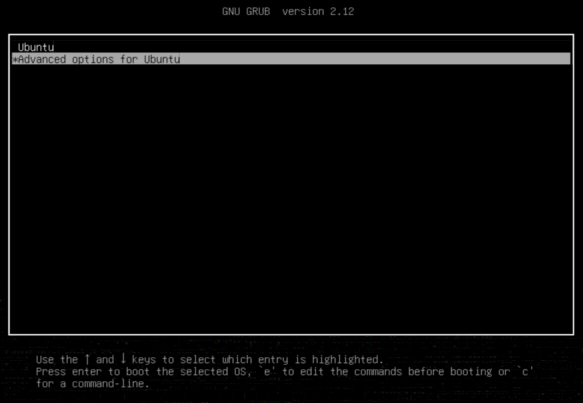
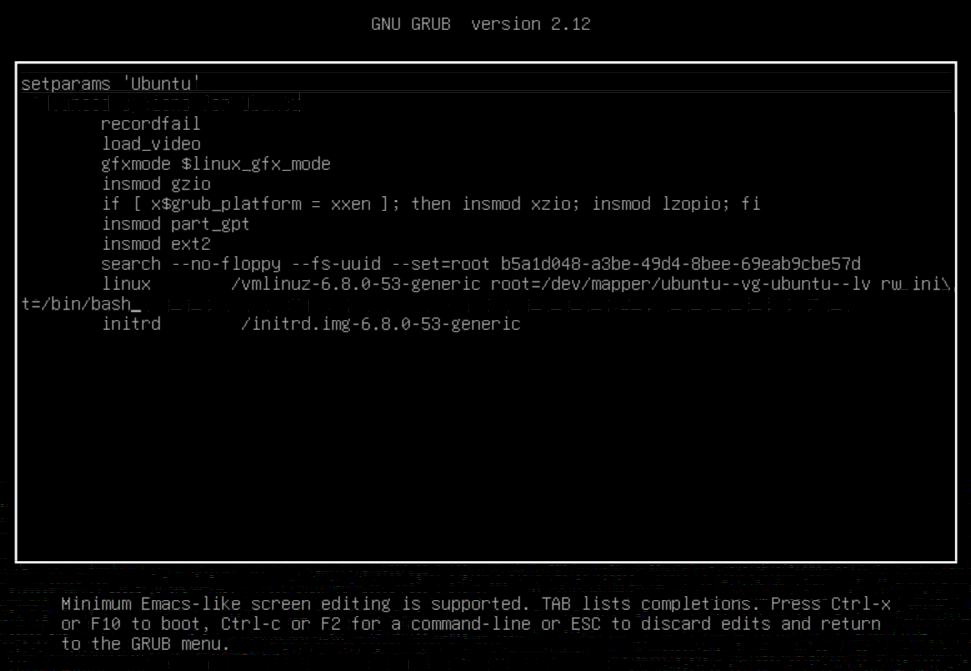
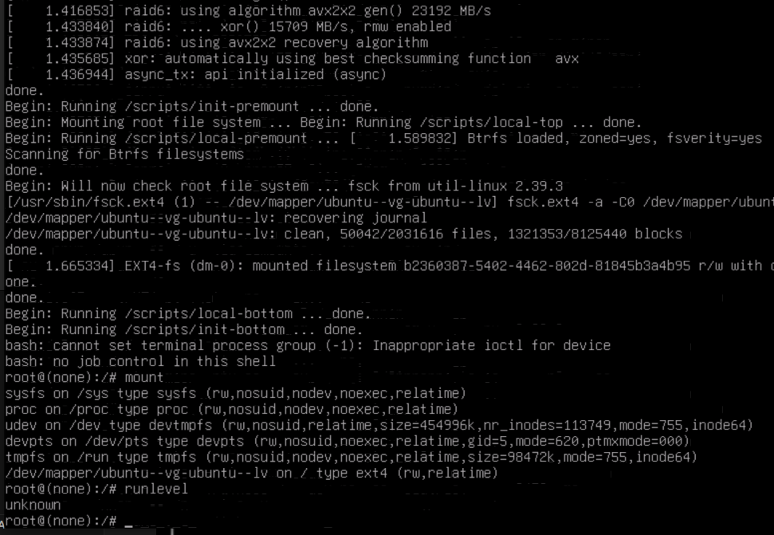
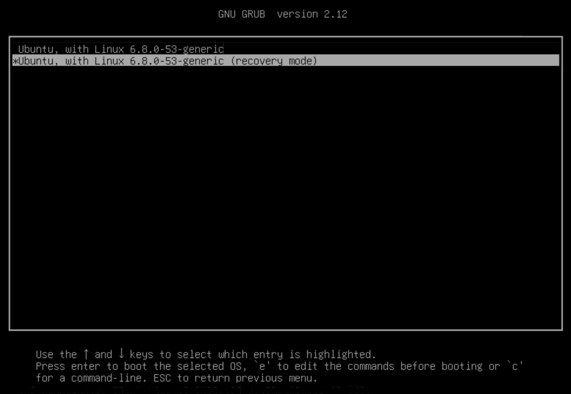
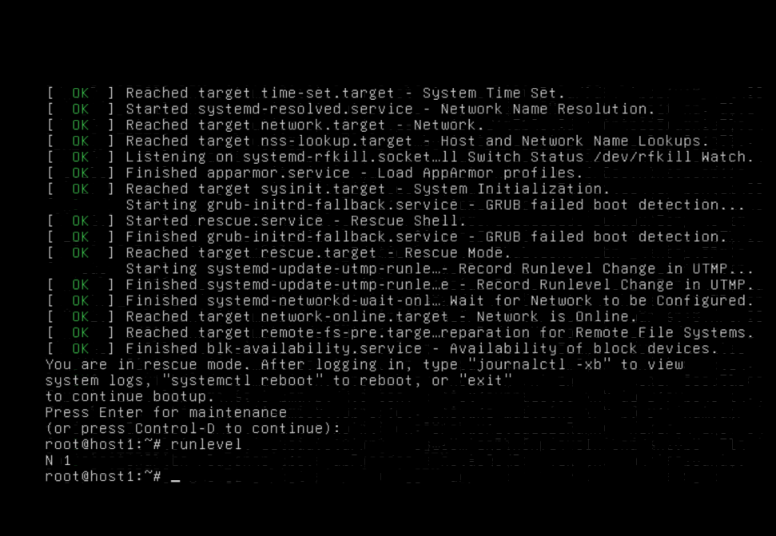

>## Цель домашнего задания:

## Загрузка системы.

>## Описание домашнего задания:

1) Включить отображение меню Grub.
2) Попасть в систему без пароля несколькими способами.
3) Установить систему с LVM, после чего переименовать VG.


Развертываем окружение ([Vagrantfile](https://github.com/slako68/Otus.Linux.Professional/tree/main/hw07/Vagrantfile)):

```console
$ vagrant up

ENV['VAGRANT_SERVER_URL'] = 'https://vagrant.elab.pro'
Vagrant.configure("2") do |config|
  N = 1
  (1..N).each do |i|  
    config.vm.define "host#{i}" do |node|
      node.vm.box = "bento/ubuntu-24.04"
      node.vm.hostname = "host#{i}"
      node.vm.network "private_network", ip: "192.168.122.10#{i}"
      node.vm.provider :libvirt do |libvirt|
        libvirt.cpus = "1"
        libvirt.memory = "1024"
      end
      node.vm.provision "shell", inline: <<-SHELL
      apt-get update
      SHELL
    end
  end
end
```

## Включаем отображение меню Grub

Комментируем строку, скрывающую меню и ставим задержку:

```console
# vi /etc/default/grub

GRUB_DEFAULT=0
#GRUB_TIMEOUT_STYLE=hidden
GRUB_TIMEOUT=10
GRUB_DISTRIBUTOR=`( . /etc/os-release; echo ${NAME:-Ubuntu} ) 2>/dev/null || echo Ubuntu`
GRUB_CMDLINE_LINUX_DEFAULT="autoinstall ds=nocloud-net;s=http://10.0.2.2:8312/ubuntu/"
GRUB_CMDLINE_LINUX="net.ifnames=0 biosdevname=0 "
```
Обновляем конфигурацию загрузчика и перезагружаемся:

```console
# update-grub
# reboot
```




## Попасть в систему без пароля несколькими способами

Способ 1. rw init=/bin/bash





Способ 2. Recovery mode





## Установить систему с LVM, после чего переименовать VG

```console
# vgs

  VG        #PV #LV #SN Attr   VSize   VFree 
  ubuntu-vg   1   1   0 wz--n- <62.00g 31.00g
```

```console
# vgrename ubuntu-vg ubuntu-otus
```

```
menuentry 'Ubuntu' --class ubuntu --class gnu-linux --class gnu --class os $menuentry_id_option 'gnulinux-simple-b2360387-5402-4462-802d-81845b3a4b95' {
	recordfail
	load_video
	gfxmode $linux_gfx_mode
	insmod gzio
	if [ x$grub_platform = xxen ]; then insmod xzio; insmod lzopio; fi
	insmod part_gpt
	insmod ext2
	search --no-floppy --fs-uuid --set=root b5a1d048-a3be-49d4-8bee-69eab9cbe57d
	linux	/vmlinuz-6.8.0-53-generic root=/dev/mapper/ubuntu--otus-ubuntu--lv ro net.ifnames=0 biosdevname=0  autoinstall ds=nocloud-net;s=http://10.0.2.2:8312/ubuntu/
	initrd	/initrd.img-6.8.0-53-generic
}
```

```console
# reboot
# vgs

  VG          #PV #LV #SN Attr   VSize   VFree 
  ubuntu-otus   1   1   0 wz--n- <62.00g 31.00g
```
