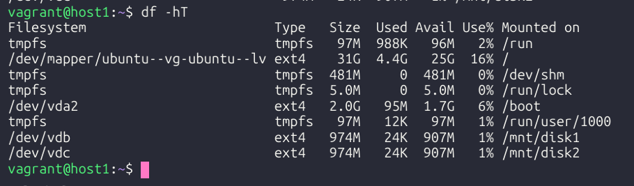
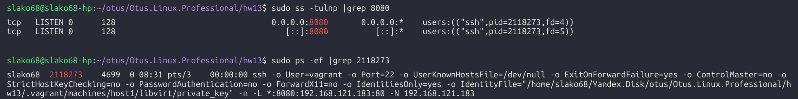

>## Цель домашнего задания:

- научиться добавлять диски и настраивать сетевые соединения;

>## Описание домашнего задания:

Подготовить стенд на Vagrant как минимум с одним сервером. На этом сервере, используя Ansible, необходимо развернуть nginx со следующими условиями:

- Подготовка окружения:

Убедитесть, что установле VirtualBox и Vagrant.
Создайте директорию для проекта.
Создать базовую виртуальную машину:
Использовать можно любой образ.
Настроите память ВМ: 1024 МБ.
Добавление дисков:
Добавьте пару виртуальных диска размером 1 ГБ каждый.
Настройка сети:
Настройте проброс 80 порта с гостевой системы на порт 8080 хостовой системы.

- Провижининг:

Напишите провижининг, который:
Форматирует добавленные диски в файловую систему ext4.
Создает точки монтирования /mnt/disk1 и /mnt/disk2.
Монтирует диски в указанные директории.
Добавляет записи в /etc/fstab для автоматического монтирования при загрузке.

## Vagranfile:

```bash
ENV['VAGRANT_SERVER_URL'] = 'https://vagrant.elab.pro'

Vagrant.configure("2") do |config|
  N = 1
  (1..N).each do |i|  
    config.vm.define "host#{i}" do |node|
      node.vm.box = "bento/ubuntu-24.04"
      node.vm.hostname = "host#{i}"
      node.vm.network "private_network", ip: "192.168.122.10#{i}"
      node.vm.network "forwarded_port", guest: 80, host: "8080"
      node.vm.synced_folder ".", "/vagrant"
      node.vm.provider :libvirt do |libvirt|
        libvirt.cpus = "2"
        libvirt.memory = "1024"
          M = 2
          (1..M).each do |j|
            libvirt.storage :file, :size => '1024M'
          end
      end
      node.vm.provision "shell", inline: <<-SHELL
      mkdir -p /mnt/disk{1,2}
      for i in {b,c}; do mkfs.ext4 -F /dev/vd$i; done
      mount /dev/vdb /mnt/disk1
      mount /dev/vdc /mnt/disk2
      echo "`blkid | grep /dev/vdb: | awk '{print $2}'` /mnt/disk1 ext4 defaults 0 0" >> /etc/fstab
      echo "`blkid | grep /dev/vdc: | awk '{print $2}'` /mnt/disk2 ext4 defaults 0 0" >> /etc/fstab
      SHELL
    end
  end
end
```

## df -hT:



## ss -tulnp |grep 8080:

