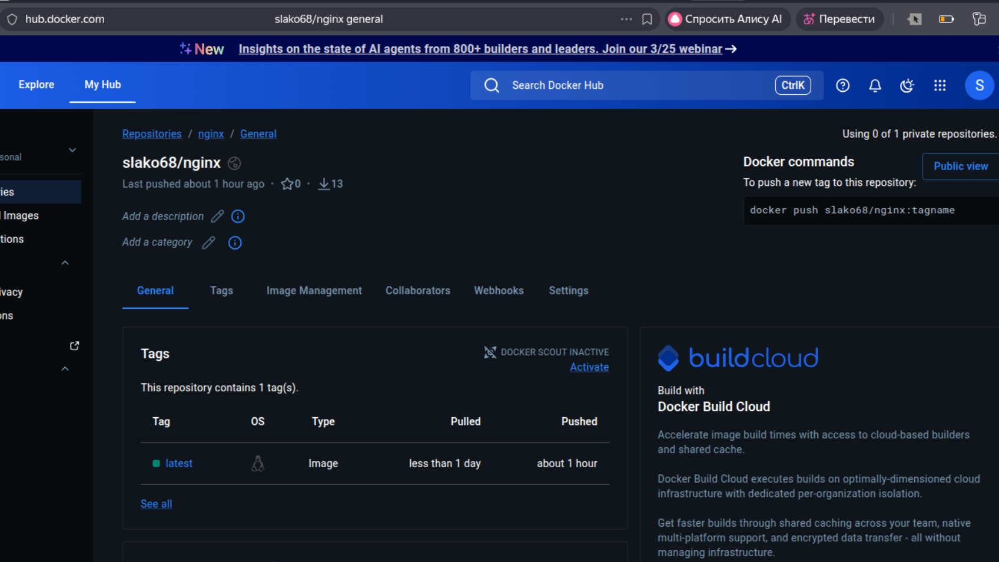
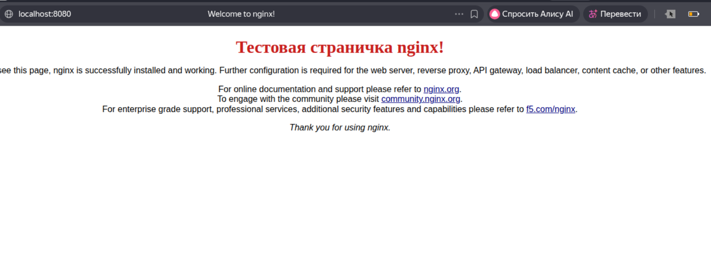

>## Цель домашнего задания:

- освоить базовые принципы работы с Docker, научиться создавать, настраивать и управлять контейнерами;

>## Описание домашнего задания:

- Установите Docker на хост машину https://docs.docker.com/engine/install/ubuntu/
- Установите Docker Compose - как плагин, или как отдельное приложение
- Создайте свой кастомный образ nginx на базе alpine. После запуска nginx должен отдавать кастомную страницу (достаточно изменить дефолтную страницу nginx)
- - Определите разницу между контейнером и образом
- Вывод опишите в домашнем задании.
- Ответьте на вопрос: Можно ли в контейнере собрать ядро?

### Dockerfile
```bash
FROM nginx:1.29.6-alpine
COPY index.html /usr/share/nginx/html
EXPOSE 80
```

### Сборка
```bash
docker build -t slako68/nginx .
```

### Загрузка в docker hub
```bash
docker push slako68/nginx
```

### Образ в [репозитории](https://hub.docker.com/repository/docker/slako68/nginx/general)



### Запуск контейнера
```bash
docker run --name nginx -d -p 8080:80 slako68/nginx
```


### Образ (image)

Образ — это неизменяемый файл-шаблон, который содержит все необходимые компоненты для запуска приложения: исходный код, системные библиотеки, зависимости, переменные окружения и конфигурационные файлы. По своей сути image — это статичный снимок определённого состояния системы.

### Контейнер (container)

Контейнер — это динамическая среда выполнения, основанная на образе. В нём происходят реальные процессы и изменения. Важно: контейнеры не могут существовать без базового образа, поскольку именно он определяет, что будет запущено и как будет настроена среда выполнения. Из одного образа можно создать неограниченное количество контейнеров, каждый из которых будет работать независимо. 


###  В контейнере можно собрать ядро 

Но внутри контейнера нет отдельного ядра. Контейнер использует ядро хостовой операционной системы. Это следует из принципа контейнеризации: контейнер не создаёт новый виртуальный компьютер для запуска программного обеспечения, а запускает процессы в существующей операционной системе. Назначение контейнера — изолировать процессы, а не запускать новое ядро. 
