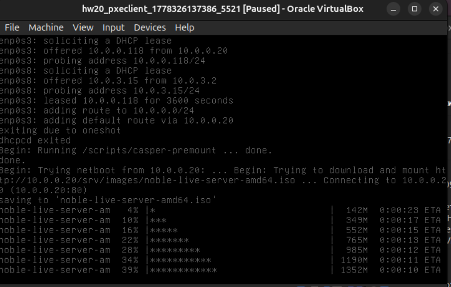

## Цель домашнего задания:

Настройка PXE сервера для автоматической установки.

## Описание домашнего задания:

- Настроить загрузку по сети дистрибутива Ubuntu 24
- Установка должна проходить из HTTP-репозитория.
- Настроить автоматическую установку c помощью файла user-data

### vagrant up
```bash
Vagrant.configure("2") do |config|
    config.vm.define "pxeserver" do |server|
        server.vm.box = 'bento/ubuntu-22.04'
        server.vm.host_name = 'pxeserver'
        server.vm.network "forwarded_port", guest: 80, host: 8080
        server.vm.network :private_network,
        ip: "10.0.0.20",
        virtualbox__intnet: 'pxenet'
        server.vm.network :private_network, ip: "192.168.50.10", adapter: 3
        server.vm.provider "virtualbox" do |vb|
            vb.memory = "1024"
            vb.customize ["modifyvm", :id,
            "--natdnshostresolver1", "on"]
        end
        server.vm.provision "ansible" do |ansible|
            ansible.playbook = "ansible/provision.yml"
            ansible.inventory_path = "ansible/hosts"
            ansible.host_key_checking = "false"
            ansible.limit = "all"
        end
    end
    config.vm.define "pxeclient" do |pxeclient|
        pxeclient.vm.box = 'bento/ubuntu-22.04'
        pxeclient.vm.host_name = 'pxeclient'
        pxeclient.vm.network :private_network, ip: "10.0.0.21"
        pxeclient.vm.provider :virtualbox do |vb|
            vb.memory = "4096"
            vb.customize ["modifyvm", :id,
            "--natdnshostresolver1", "on"]
            vb.customize [
            'modifyvm', :id,
            '--nic1', 'intnet',
            '--intnet1', 'pxenet',
            '--nic2', 'nat',
            '--boot1', 'net',
            '--boot2', 'none',
            '--boot3', 'none',
            '--boot4', 'none'
            ]
        end
    end
end
```

## Ansible provision

```bash
---
- name: network config
  hosts: all
  become: true

# 1. Настройка DHCP и TFTP-сервера

  tasks:
    - name: install dnsmasq
      ansible.builtin.apt:
        name: dnsmasq
        state: present
        update_cache: yes

    - name: disable ufw
      ansible.builtin.systemd_service:
        name: ufw
        state: stopped
        enabled: false

    - name: Set up dnsmasq
      template: 
        src: "{{ item.src }}"
        dest: "{{ item.dest }}"
        owner: root
        group: root
        mode: "{{ item.mode }}"
      with_items:
        - { src: "templates/pxe.conf", dest: "/etc/dnsmasq.d/pxe.conf", mode: "0644" }

    - name: mkdir -p /srv/tftp
      ansible.builtin.command: mkdir -p /srv/tftp

    - name: download files
      get_url:
        url: http://cdimage.ubuntu.com/ubuntu-server/noble/daily-live/current/noble-netboot-amd64.tar.gz
        dest: /tmp/noble-netboot-amd64.tar.gz
    
    - name: Extract the archive file
      ansible.builtin.unarchive:
        src: /tmp/noble-netboot-amd64.tar.gz
        dest: /srv/tftp
        remote_src: yes
        mode: "0755"

# 2. Настройка Web-сервера

    - name: install apache2
      ansible.builtin.apt:
        name: apache2
        state: present

    - name: mkdir -p /srv/images
      ansible.builtin.command: mkdir -p /srv/images

    - name: mkdir -p /srv/ks
      ansible.builtin.command: mkdir -p /srv/ks

    - name: touch /srv/ks/meta-data
      ansible.builtin.command: touch /srv/ks/meta-data

    - name: download files
      get_url:
        url: http://cdimage.ubuntu.com/ubuntu-server/noble/daily-live/current/noble-live-server-amd64.iso
        dest: /srv/images/noble-live-server-amd64.iso

    - name: Set up dnsmasq
      template: 
        src: "{{ item.src }}"
        dest: "{{ item.dest }}"
        owner: root
        group: root
        mode: "{{ item.mode }}"
      with_items:
        - { src: "templates/ks-server.conf", dest: "/etc/apache2/sites-available/ks-server.conf", mode: "0644" }
        - { src: "templates/default", dest: "/srv/tftp/amd64/pxelinux.cfg/default", mode: "0644" }
        - { src: "templates/user-data", dest: "/srv/ks/user-data", mode: "0644" }

    - name: Enable new site
      command: a2ensite ks-server.conf
 
    - name: Restart apache2
      ansible.builtin.systemd_service:
        name: apache2
        state: restarted

    - name: Restart dnsmasq
      ansible.builtin.systemd_service:
        name: dnsmasq
        state: restarted
```

## Загрузка ВМ

