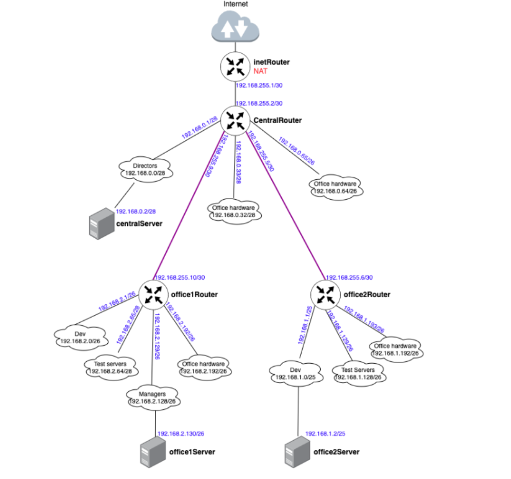

## Цель домашнего задания:

Написать сценарии iptables.

## Описание домашнего задания:

- реализовать knocking port
- centralRouter может попасть на ssh inetrRouter через knock скрипт
- добавить inetRouter2, который виден(маршрутизируется (host-only тип сети для виртуалки)) с хоста или форвардится порт через локалхост.
- запустить nginx на centralServer.
- пробросить 80й порт на inetRouter2 8080.
- дефолт в инет оставить через inetRouter.

## Схема



### vagrant up

```bash
MACHINES = {
  :inetRouter => {
        :box_name => "bento/ubuntu-24.04",
        :vm_name => "inetRouter",
        #:public => {:ip => "10.10.10.1", :adapter => 1},
        :net => [   
                    #ip, adpter, netmask, virtualbox__intnet
                    ["192.168.255.1", 2, "255.255.255.252",  "router-net"], 
                    ["192.168.50.10", 8, "255.255.255.0"],
                ]
  },

  :centralRouter => {
        :box_name => "bento/ubuntu-24.04",
        :vm_name => "centralRouter",
        :net => [
                   ["192.168.255.2",  2, "255.255.255.252",  "router-net"],
                   ["192.168.0.1",    3, "255.255.255.240",  "dir-net"],
                   ["192.168.0.33",   4, "255.255.255.240",  "hw-net"],
                   ["192.168.0.65",   5, "255.255.255.192",  "mgt-net"],
                   ["192.168.255.9",  6, "255.255.255.252",  "office1-central"],
                   ["192.168.255.5",  7, "255.255.255.252",  "office2-central"],
                   ["192.168.50.11",  8, "255.255.255.0"],
                ]
  },

  :centralServer => {
        :box_name => "bento/ubuntu-24.04",
        :vm_name => "centralServer",
        :net => [
                   ["192.168.0.2",    2, "255.255.255.240",  "dir-net"],
                   ["192.168.50.12",  8, "255.255.255.0"],
                ]
  },

  :office1Router => {
        :box_name => "bento/ubuntu-24.04",
        :vm_name => "office1Router",
        :net => [
                   ["192.168.255.10",  2,  "255.255.255.252",  "office1-central"],
                   ["192.168.2.1",     3,  "255.255.255.192",  "dev1-net"],
                   ["192.168.2.65",    4,  "255.255.255.192",  "test1-net"],
                   ["192.168.2.129",   5,  "255.255.255.192",  "managers-net"],
                   ["192.168.2.193",   6,  "255.255.255.192",  "office1-net"],
                   ["192.168.50.20",   8,  "255.255.255.0"],
                ]
  },

  :office1Server => {
        :box_name => "bento/ubuntu-24.04",
        :vm_name => "office1Server",
        :net => [
                   ["192.168.2.130",  2,  "255.255.255.192",  "managers-net"],
                   ["192.168.50.21",  8,  "255.255.255.0"],
                ]
  },

  :office2Router => {
       :box_name => "bento/ubuntu-24.04",
       :vm_name => "office2Router",
       :net => [
                   ["192.168.255.6",  2,  "255.255.255.252",  "office2-central"],
                   ["192.168.1.1",    3,  "255.255.255.128",  "dev2-net"],
                   ["192.168.1.129",  4,  "255.255.255.192",  "test2-net"],
                   ["192.168.1.193",  5,  "255.255.255.192",  "office2-net"],
                   ["192.168.50.30",  8,  "255.255.255.0"],
               ]
  },

  :office2Server => {
       :box_name => "bento/ubuntu-24.04",
       :vm_name => "office2Server",
       :net => [
                  ["192.168.1.2",    2,  "255.255.255.128",  "dev2-net"],
                  ["192.168.50.31",  8,  "255.255.255.0"],
               ]
  }
}

Vagrant.configure("2") do |config|
  MACHINES.each do |boxname, boxconfig|
    config.vm.define boxname do |box|
      box.vm.box = boxconfig[:box_name]
      box.vm.host_name = boxconfig[:vm_name]
      
      box.vm.provider "virtualbox" do |v|
        v.memory = 768
        v.cpus = 1
       end

      boxconfig[:net].each do |ipconf|
        box.vm.network("private_network", ip: ipconf[0], adapter: ipconf[1], netmask: ipconf[2], virtualbox__intnet: ipconf[3])
      end

      if boxconfig.key?(:public)
        box.vm.network "public_network", boxconfig[:public]
      end

      box.vm.provision "shell", inline: <<-SHELL
        mkdir -p ~root/.ssh
        cp ~vagrant/.ssh/auth* ~root/.ssh
      SHELL
      if boxconfig[:vm_name] == "office2Server"
        box.vm.provision "ansible" do |ansible|
            ansible.playbook = "ansible/provision.yml"
            ansible.inventory_path = "ansible/hosts"
            ansible.host_key_checking = "false"
            ansible.limit = "all"
        end
      end
    end
  end
end
```

## ansible provision

```bash
---
- name: network config
  hosts: all
  become: true

  tasks:
    - name: install traceroute
      ansible.builtin.apt:
        name: traceroute
        state: present

    - name: disable ufw
      ansible.builtin.systemd_service:
        name: ufw
        state: stopped
        enabled: false
      when: (ansible_hostname == "inetRouter")

    - name: Install iptables-persistent
      ansible.builtin.shell: |
        debconf-set-selections << "iptables-persistent iptables-persistent/autosave_v4 boolean true"
        debconf-set-selections << "iptables-persistent iptables-persistent/autosave_v6 boolean true"
      when: (ansible_hostname == "inetRouter")

    - name: install iptables-persistent
      ansible.builtin.apt:
        name: iptables-persistent
        state: present
      when: (ansible_hostname == "inetRouter")

    - name: Create /etc/iptables
      ansible.builtin.command: mkdir -p /etc/iptables
      when: (ansible_hostname == "inetRouter")

    - name: Set up NAT on inetRouter
      template: 
        src: "{{ item.src }}"
        dest: "{{ item.dest }}"
        owner: root
        group: root
        mode: "{{ item.mode }}"
      with_items:
        - { src: "templates/iptables_rules.ipv4", dest: "/etc/iptables/rules.v4", mode: "0644" }
      when: (ansible_hostname == "inetRouter")

    - name: set up forward packages across routers
      sysctl:
        name: net.ipv4.conf.all.forwarding
        value: '1'
        state: present
      when: "'routers' in group_names"

    - name: disable default route
      template: 
        src: templates/00-installer-config.yaml
        dest: /etc/netplan/00-installer-config.yaml
        owner: root
        group: root
        mode: 0644
      when: (ansible_hostname != "inetRouter") 

    - name: add default gateway for centralRouter
      template: 
        src: templates/50-vagrant_{{ansible_hostname}}.yaml
        dest: /etc/netplan/50-vagrant.yaml
        owner: root
        group: root
        mode: 0644

    - name: restart all hosts
      reboot:
        reboot_timeout: 600
```

## Все серверы видят друг друга (office2Server ping office1Server)

```bash
vagrant@office2Server:~$ ping 192.168.2.130
PING 192.168.2.130 (192.168.2.130) 56(84) bytes of data.
64 bytes from 192.168.2.130: icmp_seq=1 ttl=61 time=3.00 ms
64 bytes from 192.168.2.130: icmp_seq=2 ttl=61 time=2.79 ms
64 bytes from 192.168.2.130: icmp_seq=3 ttl=61 time=3.17 ms
^C
--- 192.168.2.130 ping statistics ---
3 packets transmitted, 3 received, 0% packet loss, time 2003ms
rtt min/avg/max/mdev = 2.790/2.987/3.174/0.156 ms
```

## Все серверы и роутеры ходят в инет черз inetRouter

```bash
vagrant@office2Server:~$ ping 8.8.8.8
PING 8.8.8.8 (8.8.8.8) 56(84) bytes of data.
64 bytes from 8.8.8.8: icmp_seq=1 ttl=58 time=28.2 ms
64 bytes from 8.8.8.8: icmp_seq=2 ttl=58 time=28.7 ms
64 bytes from 8.8.8.8: icmp_seq=3 ttl=58 time=28.7 ms
64 bytes from 8.8.8.8: icmp_seq=4 ttl=58 time=22.0 ms
^C
--- 8.8.8.8 ping statistics ---
4 packets transmitted, 4 received, 0% packet loss, time 3007ms
rtt min/avg/max/mdev = 22.044/26.926/28.736/2.827 ms


vagrant@office1Router:~$ ping 8.8.8.8
PING 8.8.8.8 (8.8.8.8) 56(84) bytes of data.
64 bytes from 8.8.8.8: icmp_seq=1 ttl=60 time=28.4 ms
64 bytes from 8.8.8.8: icmp_seq=2 ttl=60 time=21.4 ms
64 bytes from 8.8.8.8: icmp_seq=3 ttl=60 time=26.6 ms
64 bytes from 8.8.8.8: icmp_seq=4 ttl=60 time=21.7 ms
^C
--- 8.8.8.8 ping statistics ---
4 packets transmitted, 4 received, 0% packet loss, time 3004ms
rtt min/avg/max/mdev = 21.395/24.533/28.436/3.075 ms
```