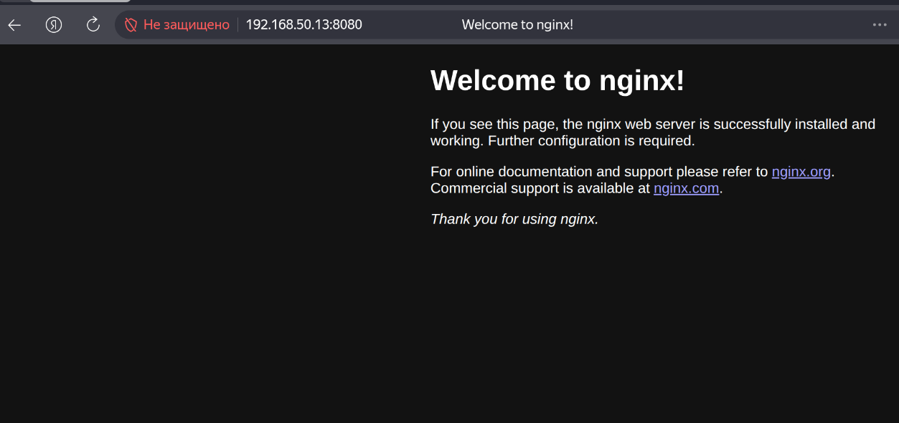

## Цель домашнего задания:

Написать сценарии iptables.

## Описание домашнего задания:

- реализовать knocking port
- centralRouter может попасть на ssh inetrRouter через knock скрипт
- добавить inetRouter2, который виден(маршрутизируется (host-only тип сети для виртуалки)) с хоста или форвардится порт через локалхост.
- запустить nginx на centralServer.
- пробросить 80й порт на inetRouter2 8080.
- дефолт в инет оставить через inetRouter.

## Схема


### настройки iptables для реализации knocking port

```bash
# Generated by iptables-save v1.8.10 (nf_tables) on Sun May 17 16:17:00 2026
*filter
:INPUT DROP [0:0]
:FORWARD ACCEPT [10617:10244661]
:OUTPUT ACCEPT [2600:219690]
:SSH-INPUT - [0:0]
:SSH-INPUTTWO - [0:0]
:TRAFFIC - [0:0]
-A INPUT -i lo -j ACCEPT
-A INPUT -j TRAFFIC
-A SSH-INPUT -m recent --set --name SSH1 --mask 255.255.255.255 --rsource -j DROP
-A SSH-INPUTTWO -m recent --set --name SSH2 --mask 255.255.255.255 --rsource -j DROP
-A TRAFFIC -p icmp -m icmp --icmp-type any -j ACCEPT
-A TRAFFIC -m state --state RELATED,ESTABLISHED -j ACCEPT
-A TRAFFIC -p tcp -m state --state NEW -m tcp --dport 22 -m recent --rcheck --seconds 60 --name SSH2 --mask 255.255.255.255 --rsource -j ACCEPT
-A TRAFFIC -p tcp -m state --state NEW -m tcp -m recent --remove --name SSH2 --mask 255.255.255.255 --rsource -j DROP
-A TRAFFIC -p tcp -m state --state NEW -m tcp --dport 9991 -m recent --rcheck --name SSH1 --mask 255.255.255.255 --rsource -j SSH-INPUTTWO
-A TRAFFIC -p tcp -m state --state NEW -m tcp -m recent --remove --name SSH1 --mask 255.255.255.255 --rsource -j DROP
-A TRAFFIC -p tcp -m state --state NEW -m tcp --dport 7771 -m recent --rcheck --name SSH0 --mask 255.255.255.255 --rsource -j SSH-INPUT
-A TRAFFIC -p tcp -m state --state NEW -m tcp -m recent --remove --name SSH0 --mask 255.255.255.255 --rsource -j DROP
-A TRAFFIC -p tcp -m state --state NEW -m tcp --dport 8881 -m recent --set --name SSH0 --mask 255.255.255.255 --rsource -j DROP
-A TRAFFIC -j DROP
COMMIT
# Completed on Sun May 17 16:17:00 2026
# Generated by iptables-save v1.8.10 (nf_tables) on Sun May 17 16:17:00 2026
*nat
:PREROUTING ACCEPT [104:7064]
:INPUT ACCEPT [3:180]
:OUTPUT ACCEPT [21:1447]
:POSTROUTING ACCEPT [11:755]
-A POSTROUTING ! -d 192.168.0.0/16 -o eth0 -j MASQUERADE
COMMIT
# Completed on Sun May 17 16:17:00 2026
```

## centralRouter может попасть на ssh inetrRouter через knock скрипт

```bash
vagrant@centralRouter:~$ ssh 192.168.255.1
ssh: connect to host 192.168.255.1 port 22: Connection timed out


vagrant@centralRouter:~$ ./knock.sh 192.168.255.1 8881 7771 9991
Starting Nmap 7.94SVN ( https://nmap.org ) at 2026-05-17 16:16 UTC
Warning: 192.168.255.1 giving up on port because retransmission cap hit (0).
Nmap scan report for 192.168.255.1
Host is up (0.00075s latency).

PORT     STATE    SERVICE
8881/tcp filtered galaxy4d
MAC Address: 08:00:27:8E:17:CD (Oracle VirtualBox virtual NIC)

Nmap done: 1 IP address (1 host up) scanned in 13.20 seconds
Starting Nmap 7.94SVN ( https://nmap.org ) at 2026-05-17 16:16 UTC
Warning: 192.168.255.1 giving up on port because retransmission cap hit (0).
Nmap scan report for 192.168.255.1
Host is up (0.00056s latency).

PORT     STATE    SERVICE
7771/tcp filtered unknown
MAC Address: 08:00:27:8E:17:CD (Oracle VirtualBox virtual NIC)

Nmap done: 1 IP address (1 host up) scanned in 13.19 seconds
Starting Nmap 7.94SVN ( https://nmap.org ) at 2026-05-17 16:16 UTC
Warning: 192.168.255.1 giving up on port because retransmission cap hit (0).
Nmap scan report for 192.168.255.1
Host is up (0.00075s latency).

PORT     STATE    SERVICE
9991/tcp filtered issa
MAC Address: 08:00:27:8E:17:CD (Oracle VirtualBox virtual NIC)

Nmap done: 1 IP address (1 host up) scanned in 13.19 seconds


vagrant@centralRouter:~$ ssh 192.168.255.1
vagrant@192.168.255.1's password: 
Welcome to Ubuntu 24.04.3 LTS (GNU/Linux 6.8.0-86-generic x86_64)

 * Documentation:  https://help.ubuntu.com
 * Management:     https://landscape.canonical.com
 * Support:        https://ubuntu.com/pro

 System information as of Sun May 17 04:16:48 PM UTC 2026

  System load:           0.02
  Usage of /:            14.8% of 30.34GB
  Memory usage:          27%
  Swap usage:            0%
  Processes:             128
  Users logged in:       0
  IPv4 address for eth0: 10.0.2.15
  IPv6 address for eth0: fd17:625c:f037:2:a00:27ff:fef8:c2eb


This system is built by the Bento project by Chef Software
More information can be found at https://github.com/chef/bento

Use of this system is acceptance of the OS vendor EULA and License Agreements.
Last login: Sun May 17 16:05:13 2026 from 192.168.255.2
```

## Добавляем inetRouter2

```bash
  :inetRouter2 => {
        :box_name => "bento/ubuntu-24.04",
        :vm_name => "inetRouter2",
        :net => [   
                    #ip, adpter, netmask, virtualbox__intnet
                    ["192.168.255.13", 2, "255.255.255.252",  "router2-net"], 
                    ["192.168.50.13", 8, "255.255.255.0"],
                ]
  },
```

## пробрасываем 80й порт на inetRouter2 8080

```bash
# Generated by iptables-save v1.8.10 (nf_tables) on Sun May 17 16:11:20 2026
*nat
:PREROUTING ACCEPT [1:44]
:INPUT ACCEPT [1:44]
:OUTPUT ACCEPT [3:180]
:POSTROUTING ACCEPT [3:180]
-A PREROUTING -p tcp -m tcp --dport 8080 -j DNAT --to-destination 192.168.0.2:80
-A POSTROUTING -o eth1 -j MASQUERADE
COMMIT
# Completed on Sun May 17 16:11:20 2026
```

