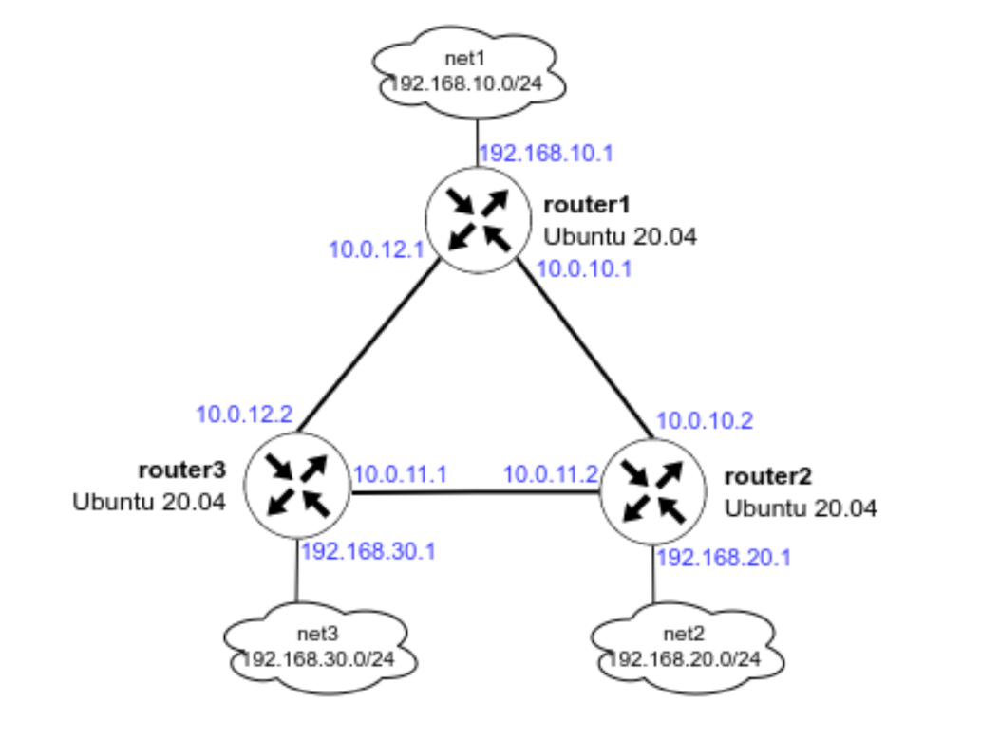

## Цель домашнего задания:

Создать домашнюю сетевую лабораторию;
Научиться настраивать протокол OSPF в Linux-based системах.

## Описание домашнего задания:

1. Поднять три виртуалки
2. Объединить их разными vlan
  - поднять OSPF между машинами на базе Quagga;
  - изобразить ассиметричный роутинг;
  - сделать один из линков "дорогим", но что бы при этом роутинг был симметричным.

## Схема



## Vagrantfile
```bash
MACHINES = {
  :router1 => {
        :box_name => "bento/ubuntu-24.04",
        :vm_name => "router1",
        :net => [
                   ['10.0.10.1', 2, "255.255.255.252", "r1-r2"],
                   ['10.0.12.1', 3, "255.255.255.252", "r1-r3"],
                   ['192.168.10.1', 4, "255.255.255.0", "net1"],
                   ['192.168.50.10', 5],
                ]
  },

  :router2 => {
        :box_name => "bento/ubuntu-24.04",
        :vm_name => "router2",
        :net => [
                   ['10.0.10.2', 2, "255.255.255.252", "r1-r2"],
                   ['10.0.11.2', 3, "255.255.255.252", "r2-r3"],
                   ['192.168.20.1', 4, "255.255.255.0", "net2"],
                   ['192.168.50.11', 5],
                ]
  },

  :router3 => {
        :box_name => "bento/ubuntu-24.04",
        :vm_name => "router3",
        :net => [
                   ['10.0.11.1', 2, "255.255.255.252", "r2-r3"],
                   ['10.0.12.2', 3, "255.255.255.252", "r1-r3"],
                   ['192.168.30.1', 4, "255.255.255.0", "net3"],
                   ['192.168.50.12', 5],
                ]
  }

}

Vagrant.configure("2") do |config|

  MACHINES.each do |boxname, boxconfig|
    
    config.vm.define boxname do |box|
   
      box.vm.box = boxconfig[:box_name]
      box.vm.host_name = boxconfig[:vm_name]

      if boxconfig[:vm_name] == "router3"
       box.vm.provision "ansible" do |ansible|
        ansible.playbook = "ansible/provision.yml"
        ansible.inventory_path = "ansible/hosts"
        ansible.host_key_checking = "false"
        ansible.limit = "all"
       end
      end

      boxconfig[:net].each do |ipconf|
        box.vm.network("private_network", ip: ipconf[0], adapter: ipconf[1], netmask: ipconf[2], virtualbox__intnet: ipconf[3])
      end

     end
  end
end
```

## Ansible provision

```bash
#Начало файла provision.yml
- name: OSPF
  #Указываем имя хоста или группу, которые будем настраивать
  hosts: all
  #Параметр выполнения модулей от root-пользователя
  become: yes
  #Указание файла с дополнителыми переменными (понадобится при добавлении темплейтов)
  vars_files:
    - defaults/main.yml
  tasks:
  # Обновление пакетов и установка vim, traceroute, tcpdump, net-tools
  - name: install base tools
    apt:
      name:
        - vim
        - traceroute
        - tcpdump
        - net-tools
      state: present
      update_cache: true

  #Отключаем UFW и удаляем его из автозагрузки
  - name: disable ufw service
    service:
      name: ufw
      state: stopped
      enabled: false

    # Добавляем gpg-key репозитория
  - name: add gpg frrouting.org
    apt_key:
      url: "https://deb.frrouting.org/frr/keys.asc"
      state: present

    # Добавляем репозиторий https://deb.frrouting.org/frr
  - name: add frr repo
    apt_repository:
      repo: 'deb https://deb.frrouting.org/frr {{ ansible_distribution_release }} frr-stable'
      state: present
    
    # Обновляем пакеты и устанавливаем FRR
  - name: install FRR packages
    apt:
      name: 
        - frr
        - frr-pythontools
      state: present
      update_cache: true

  # Включаем маршрутизацию транзитных пакетов
  - name: set up forward packages across routers
    sysctl:
      name: net.ipv4.conf.all.forwarding
      value: '1'
      state: present
  
  # Отключаем запрет ассиметричного роутинга 
  - name: set up asynchronous routing
    sysctl:
      name: net.ipv4.conf.all.rp_filter
      value: '0'
      state: present
    
  # Копируем файл daemons на хосты, указываем владельца и права
  - name: base set up OSPF 
    template:
      src: daemons
      dest: /etc/frr/daemons
      owner: frr
      group: frr
      mode: 0640

  # Копируем файл frr.conf на хосты, указываем владельца и права
  - name: set up OSPF 
    template:
      src: frr.conf.j2
      dest: /etc/frr/frr.conf
      owner: frr
      group: frr
      mode: 0640

  # Перезапускам FRR и добавляем в автозагрузку
  - name: restart FRR
    service:
      name: frr
      state: restarted
      enabled: true
```
## frr.conf.j2

```bash
!Указание версии FRR
frr version 8.1
frr defaults traditional
!Указываем имя машины
hostname {{ ansible_hostname }}
log syslog informational
no ipv6 forwarding
service integrated-vtysh-config
!
!Добавляем информацию об интерфейсе eth1
interface eth1
 !Указываем имя интерфейса
 description r1-r2
 !Указываем ip-aдрес и маску (эту информацию мы получили в прошлом шаге)
 ip address {{ ansible_eth1.ipv4.address }}/{{ ansible_eth1.ipv4.prefix }}
 !Указываем параметр игнорирования MTU
 ip ospf mtu-ignore

 ip ospf cost 1000

 ip ospf cost 1000

 !ip ospf cost 450

 !Указываем параметры hello-интервала для OSPF пакетов
 ip ospf hello-interval 10
 !Указываем параметры dead-интервала для OSPF пакетов
 !Должно быть кратно предыдущему значению
 ip ospf dead-interval 30
!
interface eth2
 description r1-r3
 ip address {{ ansible_eth2.ipv4.address }}/{{ ansible_eth2.ipv4.prefix }}
 ip ospf mtu-ignore
 !ip ospf cost 45
 ip ospf hello-interval 10
 ip ospf dead-interval 30

interface eth3
 description net_{{ ansible_hostname }}
 ip address {{ ansible_eth3.ipv4.address }}/{{ ansible_eth3.ipv4.prefix }}
 ip ospf mtu-ignore
 !ip ospf cost 45
 ip ospf hello-interval 10
 ip ospf dead-interval 30 
!
!Начало настройки OSPF
router ospf
 !Указываем router-id 
 !router-id {{ router_id }}
 !Указываем сети, которые хотим анонсировать соседним роутерам
 network {{ ansible_eth1.ipv4.network }}/{{ ansible_eth1.ipv4.prefix }} area 0
 network {{ ansible_eth2.ipv4.network }}/{{ ansible_eth2.ipv4.prefix }} area 0
 network {{ ansible_eth3.ipv4.network }}/{{ ansible_eth3.ipv4.prefix }} area 0 
 
 !Указываем адреса соседних роутеров

 neighbor {{ hostvars.router1.ansible_eth1.ipv4.address }}


 neighbor {{ hostvars.router1.ansible_eth2.ipv4.address }}


 neighbor {{ hostvars.router2.ansible_eth1.ipv4.address }}


 neighbor {{ hostvars.router2.ansible_eth2.ipv4.address }}


 neighbor {{ hostvars.router3.ansible_eth1.ipv4.address }}


 neighbor {{ hostvars.router3.ansible_eth2.ipv4.address }}


!Указываем адрес log-файла
log file /var/log/frr/frr.log
default-information originate always
```

## show ip route ospf

```bash
vagrant@router1:~$ sudo vtysh -c "show ip route ospf"
Codes: K - kernel route, C - connected, L - local, S - static,
       R - RIP, O - OSPF, I - IS-IS, B - BGP, E - EIGRP, N - NHRP,
       T - Table, v - VNC, V - VNC-Direct, A - Babel, F - PBR,
       f - OpenFabric, t - Table-Direct,
       > - selected route, * - FIB route, q - queued, r - rejected, b - backup
       t - trapped, o - offload failure

IPv4 unicast VRF default:
O   10.0.10.0/30 [110/1000] is directly connected, eth1, weight 1, 00:23:43
O>* 10.0.11.0/30 [110/200] via 10.0.12.2, eth2, weight 1, 00:22:58
O   10.0.12.0/30 [110/100] is directly connected, eth2, weight 1, 00:23:03
O   192.168.10.0/24 [110/100] is directly connected, eth3, weight 1, 00:23:43
O>* 192.168.20.0/24 [110/300] via 10.0.12.2, eth2, weight 1, 00:22:58
O>* 192.168.30.0/24 [110/200] via 10.0.12.2, eth2, weight 1, 00:22:58
```

## ip r

```bash
vagrant@router3:~$ ip r
default via 10.0.2.2 dev eth0 proto dhcp src 10.0.2.15 metric 100 
10.0.2.0/24 dev eth0 proto kernel scope link src 10.0.2.15 metric 100 
10.0.2.2 dev eth0 proto dhcp scope link src 10.0.2.15 metric 100 
10.0.2.3 dev eth0 proto dhcp scope link src 10.0.2.15 metric 100 
10.0.10.0/30 nhid 35 proto ospf metric 20 
	nexthop via 10.0.11.2 dev eth1 weight 1 
	nexthop via 10.0.12.1 dev eth2 weight 1 
10.0.11.0/30 dev eth1 proto kernel scope link src 10.0.11.1 
10.0.12.0/30 dev eth2 proto kernel scope link src 10.0.12.2 
192.168.10.0/24 nhid 36 via 10.0.12.1 dev eth2 proto ospf metric 20 
192.168.20.0/24 nhid 31 via 10.0.11.2 dev eth1 proto ospf metric 20 
192.168.30.0/24 dev eth3 proto kernel scope link src 192.168.30.1 
192.168.50.0/24 dev eth4 proto kernel scope link src 192.168.50.12 
```