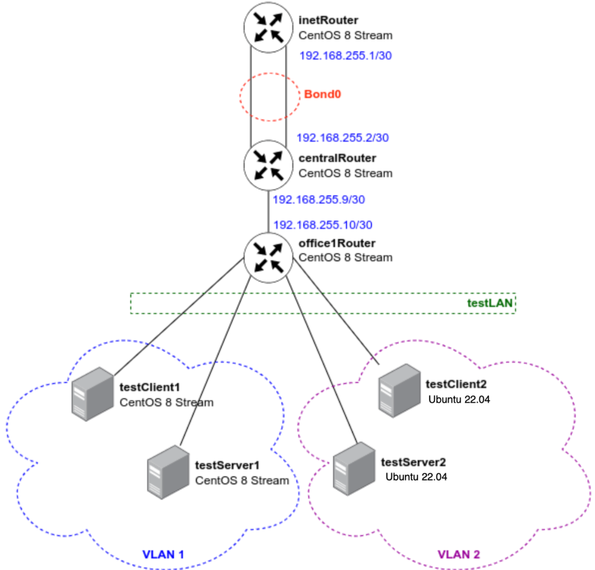

## Цель домашнего задания:

Научиться настраивать VLAN и LACP

## Описание домашнего задания:

в Office1 в тестовой подсети появляется сервера с доп интерфейсами и адресами
в internal сети testLAN:

testClient1 - 10.10.10.254
testClient2 - 10.10.10.254
testServer1- 10.10.10.1
testServer2- 10.10.10.1
Равести вланами:
testClient1 <-> testServer1
testClient2 <-> testServer2

Между centralRouter и inetRouter "пробросить" 2 линка (общая inernal сеть) и объединить их в бонд, проверить работу c отключением интерфейсов

## Схема сети



## Vagrantfile

```bash
# -*- mode: ruby -*-
# vim: set ft=ruby :

MACHINES = {
  :inetRouter => {
        :box_name => "bento/centos-stream-9",
        :vm_name => "inetRouter",
        :net => [
                   {adapter: 2, auto_config: false, virtualbox__intnet: "router-net"},
                   {adapter: 3, auto_config: false, virtualbox__intnet: "router-net"},
                   {ip: '192.168.56.10', adapter: 8},
                ]
  },
  :centralRouter => {
        :box_name => "bento/centos-stream-9",
        :vm_name => "centralRouter",
        :net => [
                   {adapter: 2, auto_config: false, virtualbox__intnet: "router-net"},
                   {adapter: 3, auto_config: false, virtualbox__intnet: "router-net"},
                   {ip: '192.168.255.9', adapter: 6, netmask: "255.255.255.252", virtualbox__intnet: "office1-central"},
                   {ip: '192.168.56.11', adapter: 8},
                ]
  },

  :office1Router => {
        :box_name => "bento/centos-stream-9",
        :vm_name => "office1Router",
        :net => [
                   {ip: '192.168.255.10', adapter: 2, netmask: "255.255.255.252", virtualbox__intnet: "office1-central"},
                   {adapter: 3, auto_config: false, virtualbox__intnet: "vlan1"},
                   {adapter: 4, auto_config: false, virtualbox__intnet: "vlan1"},
                   {adapter: 5, auto_config: false, virtualbox__intnet: "vlan2"},
                   {adapter: 6, auto_config: false, virtualbox__intnet: "vlan2"},
                   {ip: '192.168.56.20', adapter: 8},
                ]
  },

  :testClient1 => {
        :box_name => "bento/centos-stream-9",
        :vm_name => "testClient1",
        :net => [
                   {adapter: 2, auto_config: false, virtualbox__intnet: "testLAN"},
                   {ip: '192.168.56.21', adapter: 8},
                ]
  },

  :testServer1 => {
        :box_name => "bento/centos-stream-9",
        :vm_name => "testServer1",
        :net => [
                   {adapter: 2, auto_config: false, virtualbox__intnet: "testLAN"},
                   {ip: '192.168.56.22', adapter: 8},
            ]
  },

  :testClient2 => {
        :box_name => "bento/ubuntu-24.04",
        :vm_name => "testClient2",
        :net => [
                   {adapter: 2, auto_config: false, virtualbox__intnet: "testLAN"},
                   {ip: '192.168.56.31', adapter: 8},
                ]
  },

  :testServer2 => {
        :box_name => "bento/ubuntu-24.04",
        :vm_name => "testServer2",
        :net => [
                   {adapter: 2, auto_config: false, virtualbox__intnet: "testLAN"},
                   {ip: '192.168.56.32', adapter: 8},
                ]
  },

}

Vagrant.configure("2") do |config|

  MACHINES.each do |boxname, boxconfig|
    
    config.vm.define boxname do |box|
   
      box.vm.box = boxconfig[:box_name]
      box.vm.host_name = boxconfig[:vm_name]
      box.vm.box_version = boxconfig[:box_version]

      config.vm.provider "virtualbox" do |v|
        v.memory = 1024
        v.cpus = 2
       end

      if boxconfig[:vm_name] == "testServer2"
       box.vm.provision "ansible" do |ansible|
        ansible.playbook = "ansible/provision.yml"
        ansible.inventory_path = "ansible/hosts"
        ansible.host_key_checking = "false"
        ansible.become = "true"
        ansible.limit = "all"
       end
      end

      boxconfig[:net].each do |ipconf|
        box.vm.network "private_network", **ipconf
      end

      box.vm.provision "shell", inline: <<-SHELL
        mkdir -p ~root/.ssh
        cp ~vagrant/.ssh/auth* ~root/.ssh
      SHELL
    end
  end
end
```

## provision.yml

```bash
- name: Base set up
  #Настройка производится на всех хостах
  hosts: all
  become: yes
  tasks:
    #Установка приложений на RedHat-based системах
    - name: install software on CentOS
      yum:
        name:
          - vim
          - traceroute
          - tcpdump
          - net-tools
        state: present
        update_cache: true
      when: (ansible_os_family == "RedHat")
    
    #Установка приложений на Debian-based системах
    - name: install software on Debian-based
      apt:
        name: 
          - vim
          - traceroute
          - tcpdump
          - net-tools
        state: present
        update_cache: true
      when: (ansible_os_family == "Debian")

- name: set up vlan1
  #Настройка будет производиться на хостах testClient1 и testServer1
  hosts: testClient1,testServer1
  #Настройка производится от root-пользователя
  become: yes
  tasks:
    #Добавление темплейта в файл /etc/sysconfig/network-scripts/ifcfg-vlan1
    - name: set up vlan1
      template:
        src: ifcfg-vlan1.j2
        dest: /etc/sysconfig/network-scripts/ifcfg-vlan1
        owner: root
        group: root
        mode: 0644
    
    #Перезапуск службы NetworkManager
    - name: restart network for vlan1
      service:
        name: NetworkManager
        state: restarted

- name: set up vlan2
  hosts: testClient2,testServer2
  become: yes
  tasks:
    - name: set up vlan2
      template:
        src: 50-cloud-init.yaml.j2
        dest: /etc/netplan/50-cloud-init.yaml 
        owner: root
        group: root
        mode: 0644

    - name: apply set up vlan2
      shell: netplan apply
      become: true

- name: set up bond0
  hosts: inetRouter,centralRouter
  become: yes
  tasks:
    - name: set up ifcfg-bond0
      template:
        src: ifcfg-bond0.j2
        dest: /etc/sysconfig/network-scripts/ifcfg-bond0
        owner: root
        group: root
        mode: 0644
    
    - name: set up eth1,eth2
      copy: 
        src: "{{ item }}" 
        dest: /etc/sysconfig/network-scripts/
        owner: root
        group: root
        mode: 0644
      with_items:
        - templates/ifcfg-enp0s8
        - templates/ifcfg-enp0s9
    #Перезагрузка хостов 
    - name: restart hosts for bond0
      reboot:
        reboot_timeout: 3600
```

## Проверка VLAN в Ubuntu:

```bash
5: vlan2@eth1: <BROADCAST,MULTICAST,UP,LOWER_UP> mtu 1500 qdisc noqueue state UP group default qlen 1000
    link/ether 08:00:27:92:41:0e brd ff:ff:ff:ff:ff:ff
    inet 10.10.10.254/24 brd 10.10.10.255 scope global vlan2
       valid_lft forever preferred_lft forever
    inet6 fe80::a00:27ff:fe92:410e/64 scope link 
       valid_lft forever preferred_lft forever

vagrant@testClient2:~$ ping 10.10.10.1
PING 10.10.10.1 (10.10.10.1) 56(84) bytes of data.
64 bytes from 10.10.10.1: icmp_seq=1 ttl=64 time=1.41 ms
64 bytes from 10.10.10.1: icmp_seq=2 ttl=64 time=0.601 ms
64 bytes from 10.10.10.1: icmp_seq=3 ttl=64 time=0.674 ms
^C
--- 10.10.10.1 ping statistics ---
3 packets transmitted, 3 received, 0% packet loss, time 2012ms
rtt min/avg/max/mdev = 0.601/0.893/1.406/0.363 ms


5: vlan2@eth1: <BROADCAST,MULTICAST,UP,LOWER_UP> mtu 1500 qdisc noqueue state UP group default qlen 1000
    link/ether 08:00:27:6a:24:8b brd ff:ff:ff:ff:ff:ff
    inet 10.10.10.1/24 brd 10.10.10.255 scope global vlan2
       valid_lft forever preferred_lft forever
    inet6 fe80::a00:27ff:fe6a:248b/64 scope link 
       valid_lft forever preferred_lft forever

vagrant@testServer2:~$ ping 10.10.10.254
PING 10.10.10.254 (10.10.10.254) 56(84) bytes of data.
64 bytes from 10.10.10.254: icmp_seq=1 ttl=64 time=0.478 ms
64 bytes from 10.10.10.254: icmp_seq=2 ttl=64 time=0.524 ms
64 bytes from 10.10.10.254: icmp_seq=3 ttl=64 time=0.587 ms
^C
--- 10.10.10.254 ping statistics ---
3 packets transmitted, 3 received, 0% packet loss, time 2084ms
rtt min/avg/max/mdev = 0.478/0.529/0.587/0.044 ms
```

## Проверка VLAN в CentOS Stream:

```bash
5: enp0s8.1@enp0s8: <BROADCAST,MULTICAST,UP,LOWER_UP> mtu 1500 qdisc noqueue state UP group default qlen 1000
    link/ether 08:00:27:5d:90:0a brd ff:ff:ff:ff:ff:ff
    inet 10.10.10.254/24 brd 10.10.10.255 scope global noprefixroute enp0s8.1
       valid_lft forever preferred_lft forever
    inet6 fe80::a00:27ff:fe5d:900a/64 scope link 
       valid_lft forever preferred_lft forever

[vagrant@testClient1 ~]$ ping 10.10.10.1
PING 10.10.10.1 (10.10.10.1) 56(84) bytes of data.
64 bytes from 10.10.10.1: icmp_seq=1 ttl=64 time=2.28 ms
64 bytes from 10.10.10.1: icmp_seq=2 ttl=64 time=1.19 ms
64 bytes from 10.10.10.1: icmp_seq=3 ttl=64 time=0.984 ms
^C
--- 10.10.10.1 ping statistics ---
3 packets transmitted, 3 received, 0% packet loss, time 2004ms
rtt min/avg/max/mdev = 0.984/1.484/2.277/0.567 ms


5: enp0s8.1@enp0s8: <BROADCAST,MULTICAST,UP,LOWER_UP> mtu 1500 qdisc noqueue state UP group default qlen 1000
    link/ether 08:00:27:02:59:89 brd ff:ff:ff:ff:ff:ff
    inet 10.10.10.1/24 brd 10.10.10.255 scope global noprefixroute enp0s8.1
       valid_lft forever preferred_lft forever
    inet6 fe80::a00:27ff:fe02:5989/64 scope link 
       valid_lft forever preferred_lft forever

[vagrant@testServer1 ~]$ ping 10.10.10.254
PING 10.10.10.254 (10.10.10.254) 56(84) bytes of data.
64 bytes from 10.10.10.254: icmp_seq=1 ttl=64 time=1.08 ms
64 bytes from 10.10.10.254: icmp_seq=2 ttl=64 time=1.08 ms
64 bytes from 10.10.10.254: icmp_seq=3 ttl=64 time=0.852 ms
^C
--- 10.10.10.254 ping statistics ---
3 packets transmitted, 3 received, 0% packet loss, time 2003ms
rtt min/avg/max/mdev = 0.852/1.002/1.078/0.106 ms
```

## Проверка LACP между хостами inetRouter и centralRouter

```bash
6: bond0: <BROADCAST,MULTICAST,MASTER,UP,LOWER_UP> mtu 1500 qdisc noqueue state UP group default qlen 1000
    link/ether 08:00:27:64:61:70 brd ff:ff:ff:ff:ff:ff
    inet 192.168.255.1/30 brd 192.168.255.3 scope global noprefixroute bond0
       valid_lft forever preferred_lft forever
    inet6 fe80::a00:27ff:fe64:6170/64 scope link 
       valid_lft forever preferred_lft forever

[vagrant@inetRouter ~]$ ping 192.168.255.2
PING 192.168.255.2 (192.168.255.2) 56(84) bytes of data.
64 bytes from 192.168.255.2: icmp_seq=1 ttl=64 time=1.72 ms
64 bytes from 192.168.255.2: icmp_seq=2 ttl=64 time=0.988 ms
64 bytes from 192.168.255.2: icmp_seq=3 ttl=64 time=0.947 ms
^C
--- 192.168.255.2 ping statistics ---
3 packets transmitted, 3 received, 0% packet loss, time 2001ms
rtt min/avg/max/mdev = 0.947/1.218/1.719/0.354 ms


[vagrant@inetRouter ~]$ sudo ip link set down enp0s8


[vagrant@inetRouter ~]$ ping 192.168.255.2
PING 192.168.255.2 (192.168.255.2) 56(84) bytes of data.
64 bytes from 192.168.255.2: icmp_seq=1 ttl=64 time=1.61 ms
64 bytes from 192.168.255.2: icmp_seq=2 ttl=64 time=1.11 ms
64 bytes from 192.168.255.2: icmp_seq=3 ttl=64 time=0.717 ms
64 bytes from 192.168.255.2: icmp_seq=4 ttl=64 time=0.919 ms
^C
--- 192.168.255.2 ping statistics ---
4 packets transmitted, 4 received, 0% packet loss, time 3026ms
rtt min/avg/max/mdev = 0.717/1.088/1.606/0.329 ms
```