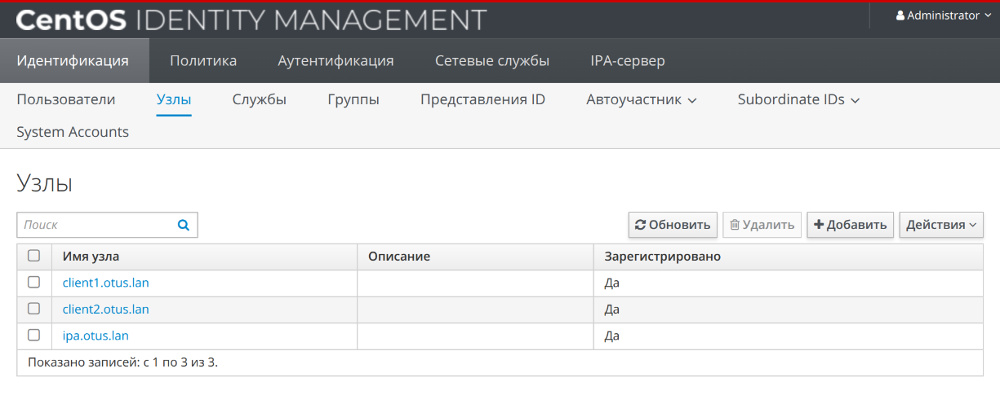
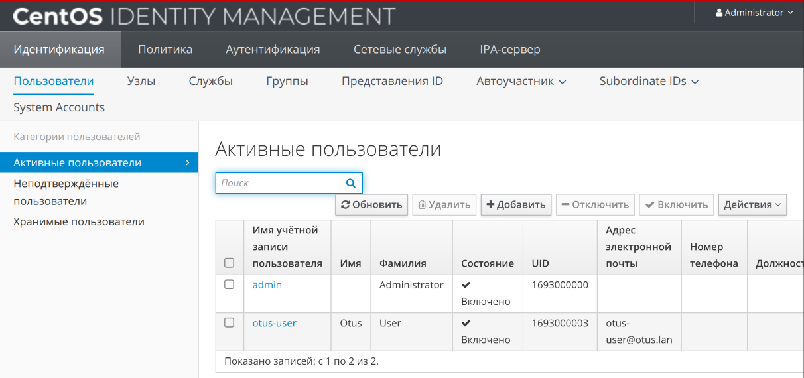

## Цель домашнего задания:

Научиться настраивать LDAP-сервер и подключать к нему LDAP-клиентов

## Описание домашнего задания:

- Установить FreeIPA
- Написать Ansible-playbook для конфигурации клиента
- Firewall должен быть включен на сервере и на клиенте

## Создание ВМ и настройка сервера

```bash
Vagrant.configure("2") do |config|
    config.vm.box = "bento/centos-stream-9"
 
    config.vm.provider :virtualbox do |v|
      v.memory = 2048
      v.cpus = 2
    end
  
    # Указываем имена хостов и их IP-адреса
    boxes = [
      { :name => "ipa.otus.lan",
        :ip => "192.168.57.10",
      },
      { :name => "client1.otus.lan",
        :ip => "192.168.57.11",
      },
      { :name => "client2.otus.lan",
        :ip => "192.168.57.12",
      }
    ]
    # Цикл запуска виртуальных машин
    boxes.each do |opts|
      config.vm.define opts[:name] do |config|
        config.vm.hostname = opts[:name]
        config.vm.network "private_network", ip: opts[:ip]
        if opts[:name] == "client2.otus.lan"
          config.vm.provision "ansible" do |ansible|
            ansible.playbook = "ansible/provision.yml"
            ansible.inventory_path = "ansible/hosts"
            ansible.host_key_checking = "false"
            ansible.limit = "all"
          end
        end
      end
    end
end
```

```bash
- name: setup FreeIPA-server
  hosts: ipa.otus.lan
  become: yes
  tasks:
    - name: install software
      yum:
        name:
          - ipa-server
        state: present
        update_cache: true

    - name: Set up timezone
      timezone:
        name: "Europe/Moscow"

    - name: Copy hosts
      copy:
        src: templates/hosts
        dest: /etc/hosts

    - name: Open application ports
      ansible.posix.firewalld:
        port: "{{ item }}"
        permanent: true
        immediate: true
        state: enabled
      loop:
        - 80/tcp
        - 443/tcp
        - 88/tcp
        - 389/tcp
        - 464/tcp
```

## Установка FreeIPA сервер

```bash
[root@ipa ~]# ipa-server-install
```

```bash
Setup complete

Next steps:
	1. You must make sure these network ports are open:
		TCP Ports:
		  * 80, 443: HTTP/HTTPS
		  * 389, 636: LDAP/LDAPS
		  * 88, 464: kerberos
		  * 53: bind
		UDP Ports:
		  * 88, 464: kerberos
		  * 53: bind
		  * 123: ntp

	2. You can now obtain a kerberos ticket using the command: 'kinit admin'
	   This ticket will allow you to use the IPA tools (e.g., ipa user-add)
	   and the web user interface.

Be sure to back up the CA certificates stored in /root/cacert.p12
These files are required to create replicas. The password for these
files is the Directory Manager password
The ipa-server-install command was successful
```

## Добавление клиентов

```bash
ansible-playbook ansible/clients.yml -e pass=12345678
```
```bash
- name: setup FreeIPA clients
  hosts: clients
  become: yes
  tasks:
    #Установка временной зоны Европа/Москва    
    - name: Set up timezone
      timezone:
        name: "Europe/Moscow"
        
    #Копирование файла /etc/hosts c правами root:root 0644
    - name: change /etc/hosts
      template:
        src: hosts
        dest: /etc/hosts
        owner: root
        group: root
        mode: 0644
    
    #Установка клиента Freeipa
    - name: install module ipa-client
      yum:
        name:
          - freeipa-client
        state: present
        update_cache: true
    
    #Запуск скрипта добавления хоста к серверу
    - name: add host to ipa-server
      shell: echo -e "yes\nyes" | ipa-client-install --mkhomedir --domain=OTUS.LAN --server=ipa.otus.lan --no-ntp -p admin -w {{ pass }}
```



## Создание пользователя

```bash
[vagrant@client1 ~]$ ipa user-add otus-user --first=Otus --last=User --password
Password: 
Enter Password again to verify: 
----------------------
Added user "otus-user"
----------------------
  User login: otus-user
  First name: Otus
  Last name: User
  Full name: Otus User
  Display name: Otus User
  Initials: OU
  Home directory: /home/otus-user
  GECOS: Otus User
  Login shell: /bin/sh
  Principal name: otus-user@OTUS.LAN
  Principal alias: otus-user@OTUS.LAN
  User password expiration: 20260530161825Z
  Email address: otus-user@otus.lan
  UID: 1693000003
  GID: 1693000003
  Password: True
  Member of groups: ipausers
  Kerberos keys available: True
```

```bash
vagrant ssh client2.otus.lan

This system is built by the Bento project by Chef Software
More information can be found at https://github.com/chef/bento

Use of this system is acceptance of the OS vendor EULA and License Agreements.
Last login: Sat May 30 19:14:20 2026 from 192.168.57.1
[vagrant@client2 ~]$ kinit otus-user
Password for otus-user@OTUS.LAN: 
Password expired.  You must change it now.
Enter new password: 
Enter it again: 
[vagrant@client2 ~]$ 
```

