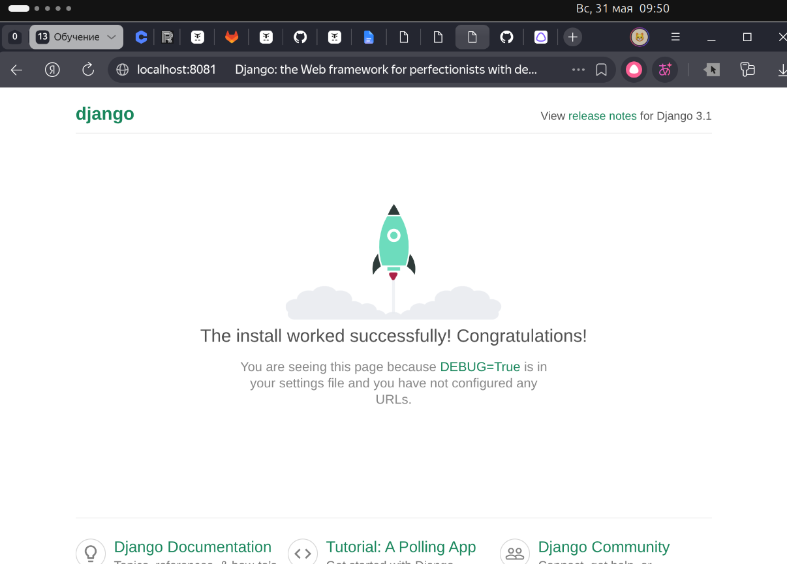
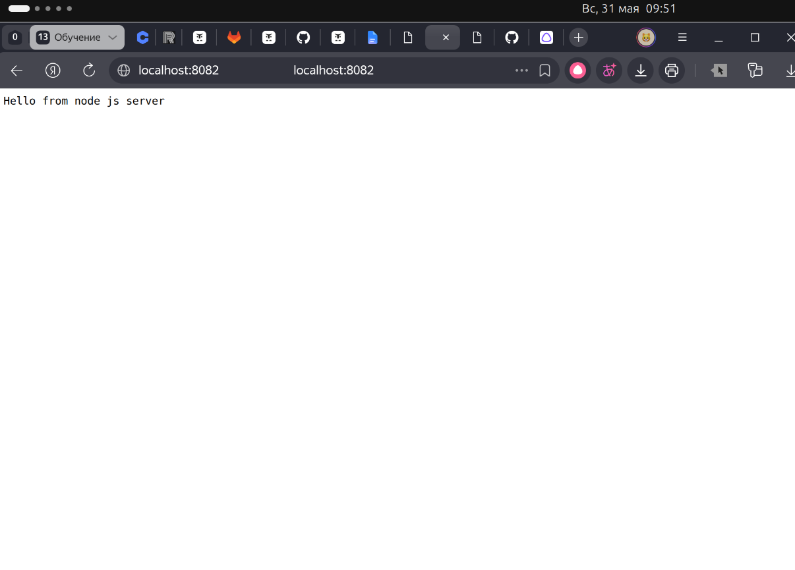
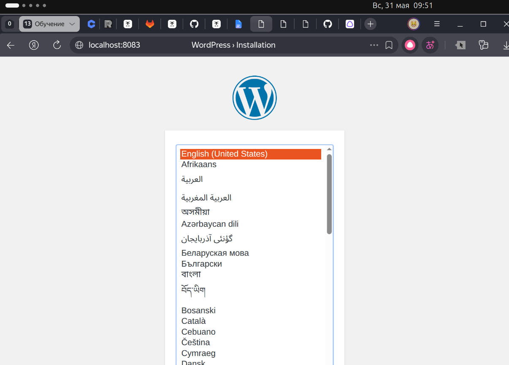

## Цель домашнего задания:

- Получить практические навыки в настройке инфраструктуры с помощью манифестов и конфигураций;
- Отточить навыки использования ansible/vagrant/docker;

## Описание домашнего задания:

- nginx + php-fpm (laravel/wordpress) + python (flask/django) + js(react/angular);

## Vagrantfile

```bash
Vagrant.configure(2) do |config|

     config.vm.provision "ansible" do |ansible|
       ansible.playbook = "prov.yml"
     end
  
     config.vm.define "DynamicWeb" do |vmconfig| 
      vmconfig.vm.box = 'bento/ubuntu-24.04'
      vmconfig.vm.hostname = 'DynamicWeb'

      vmconfig.vm.network "forwarded_port", guest: 8083, host: 8083
      vmconfig.vm.network "forwarded_port", guest: 8081, host: 8081
      vmconfig.vm.network "forwarded_port", guest: 8082, host: 8082
      vmconfig.vm.provider "virtualbox" do |vbx|
       vbx.memory = "2048"
       vbx.cpus = "4"
       vbx.customize ["modifyvm", :id, '--audio', 'none']
      end
     end
  
  end
```

## ansible playbook

```bash
- name: setup DynamicWeb
  hosts: DynamicWeb # имя хоста, который мы создадим Vagrant`om
  become: yes # Установка Docker через sudo
  gather_facts: false
  tasks: # Перечисляем задачи которые выполнит наш playbook
    - name: Install docker packages # устанавливаем пакеты необходимые для установки докера
      become: yes
      apt:
        name: "{{ item }}"
        state: present
        update_cache: yes
      with_items:
        - apt-transport-https
        - ca-certificates
        - curl
        - software-properties-common
      tags:
        - docker

    - name: Add Docker s official GPG key
      become: yes
      apt_key:
        url: https://download.docker.com/linux/ubuntu/gpg
        state: present
      tags:
        - docker

    - name: Verify that we have the key with the fingerprint
      become: yes    
      apt_key:
        id: 0EBFCD88
        state: present
      tags:
        - docker

    - name: Set up the stable repository # добавляем репозиторий докера
      become: yes    
      apt_repository:
        repo: deb [arch=amd64] https://download.docker.com/linux/ubuntu noble stable
        state: present
        update_cache: yes
      tags:
        - docker

    - name: Update apt packages
      become: yes    
      apt:
        update_cache: yes
      tags:
        - docker      

    - name: Install docker # установка докера
      become: yes    
      apt:
        name: docker-ce
        state: present
        update_cache: yes
      tags:
        - docker

    - name: Add remote "vagrant" user to "docker" group
      become: yes
      user:
        name: vagrant
        groups: docker
        append: yes
      tags:
        - docker 

    # - name: Install docker-compose 
    #   become: yes
    #   get_url:
    #     url : https://github.com/docker/compose/releases/download/1.25.1-rc1/docker-compose-Linux-x86_64
    #     dest: /usr/local/bin/docker-compose
    #     mode: 0777

    - name: Copy project # Копируем проект с хост машины в созданную через vagrant
      copy: src=project dest=/home/vagrant

    - name: reset ssh connection # чтобы применились права на использование docker, необходимо перелогиниться
      meta: reset_connection

    - name: Run container
      shell:
        cmd: "docker compose -f docker-compose.yml up -d"
        chdir: /home/vagrant/project
```

## Проверка



